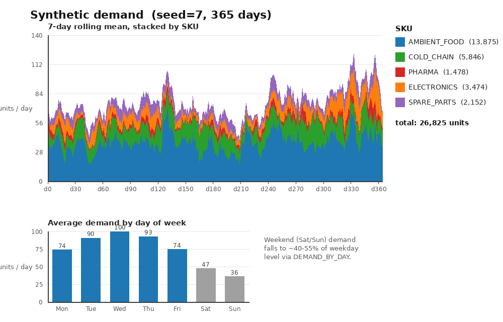

Examples
========

The sda-mc-simulator includes complete, working examples that demonstrate how to set up and run sequential decision problems. This section walks through the **Logistics Dispatch** example in detail.

Logistics Dispatch Example
==========================

Overview
--------

The logistics example simulates a road-freight distribution network across Spain. It demonstrates:

- Setting up a complex sequential decision problem with multiple interdependent variables
- Designing and comparing competing dispatch policies
- Evaluating policies using Monte Carlo simulation with historical bootstrap sampling
- Interpreting results with confidence intervals and tail-risk metrics

**The Problem in One Sentence:**
Find a daily dispatch policy that maximizes on-time, high-priority delivery service across uncertain demand and disruptions, while keeping late-delivery cost—especially in worst-case scenarios—low.

The Business Context
~~~~~~~~~~~~~~~~~~~~~

A distribution company operates three warehouses (Madrid, Barcelona, Valencia) serving 12 customer locations across Spain. Each day:

1. Customer **orders** arrive for specific products (SKUs)
2. Each order must be picked from a **warehouse** that holds the SKU
3. Orders are delivered by **vehicle** before a **deadline**
4. The fleet is limited and heterogeneous, so not all orders can be served immediately

The decision to make each day is an **assignment**: which pending orders to dispatch, from which warehouse, on which vehicle. Under uncertainty about future demand, traffic, and vehicle availability, the goal is to maximize service value while minimizing lateness costs.

The Network
-----------

The network defines the physical backbone of the problem:

**Nodes:**

- **3 Warehouses** (supply): W_MADRID, W_BARCELONA, W_VALENCIA — positioned to cover the country from three directions
- **12 Customers** (demand): Spread across mainland Spain, from Bilbao in the north to Sevilla in the south

**Geographic Distances:**

The lanes form an asymmetric 3×12 distance matrix (road distances, km). Each customer has a "home" warehouse with short distance and one or more distant alternatives:

.. code-block:: text

    Lane                From Madrid  From Barcelona  From Valencia
    ─────────────────────────────────────────────────────────────
    → C_MADRID_CENTRO       10           620            355
    → C_BARCELONA_PORT      620           10            350
    → C_VALENCIA            355          350             10
    → C_CASTELLON           425          285             70
    → C_BILBAO              395          605            610
    → C_SEVILLA             530         1000            660

This asymmetry is crucial: it forces the policy to trade off "nearest warehouse" against "warehouse that actually has the stock and an available truck."

The State Space
---------------

At any point in time, the simulator tracks:

.. code-block:: text

    State:
      inventory          per-warehouse stock of each SKU
      vehicles           fleet of 6 heterogeneous trucks (capacity 18–32 units)
                         - location, load, status (available/en_route)
                         - route, remaining travel time
      pending_orders     orders awaiting dispatch
      completed_orders   orders already delivered
      time, day_of_week  current simulation time

Each **Order** has:

- ``origin`` — warehouse for pickup
- ``destination`` — customer location
- ``sku`` — product code
- ``quantity`` — units to deliver
- ``priority`` — 1, 2, or 3 (higher = more valuable)
- ``deadline`` — day by which delivery is required

A **Decision** is a set of **Assignments**, each binding one order to one (warehouse, vehicle) pair. An assignment is feasible only when:

- The warehouse holds enough of the order's SKU
- The vehicle is currently at that warehouse
- The vehicle is available and has capacity

Each order and vehicle can be assigned at most once per day.

Exogenous Uncertainty
~~~~~~~~~~~~~~~~~~~~~

The policy does not control these factors, revealed each day as ``ExogenousInfo``:

- **New orders** — demand sampled from per-SKU profiles, modulated by day-of-week patterns, seasonality, and regional weights
- **Travel times** — per-vehicle traffic delays
- **Vehicle availability** — random maintenance/outages

Demand and disruptions are driven by stochastic events (holiday peaks, promotions, severe weather, port congestion), which lift demand and traffic and raise outage probability.

Inspecting the Synthetic Demand
~~~~~~~~~~~~~~~~~~~~~~~~~~~~~~~~

The exogenous demand is produced by ``synthetic_history(days, seed)`` in
``data.py``. The ``seed`` argument makes the entire history reproducible, so the
same seed always yields the same orders, travel times, and outages. This is what
the simulator resamples (via 7-day blocks) to drive each replication.

You can render the demand for a specific seed with the helper script:

.. code-block:: bash

    python visualize_demand.py --seed 7 --days 365

This generates ``logistics_synthetic_demand.png``, a two-panel view of the
ordered quantity:

The **top panel** is a 7-day rolling mean of daily ordered quantity, stacked by
SKU, so the annual trend and product mix stand out without day-to-day noise.
The **bottom panel** shows the average units per day grouped by day of week —
this is deliberately a separate view, because a 7-day rolling average cancels
out the weekly cycle, hiding exactly the weekend effect we want to see.

A few patterns are visible in the data and follow directly from ``data.py``:

- **Weekly rhythm** — weekend demand falls to roughly 40–55% of the weekday
  level (bottom panel), driven by ``DEMAND_BY_DAY`` (Saturday/Sunday multipliers
  of 0.55 and 0.40), while midweek peaks on Wednesday (multiplier 1.20).
- **Annual seasonality** — the smoothed area rises toward the end of the
  history, reflecting ``MONTHLY_SEASONALITY`` peaking at 1.35 in the final
  month, plus November ``holiday_peak`` and ``ELECTRONICS`` spikes.
- **SKU mix** — ``AMBIENT_FOOD`` dominates volume (its sampling weight and mean
  quantity are the largest), while ``PHARMA`` contributes the smallest share but
  carries the highest priority.

Because both panels are fully determined by the seed, this figure is a quick way
to sanity check a demand scenario before running the policies against it.

Transition and Reward
~~~~~~~~~~~~~~~~~~~~~

Each day, the simulation:

1. **Apply decisions** — validate each assignment, decrement warehouse inventory, load the vehicle, set it en_route
2. **Move vehicles** — decrement travel time; when vehicles arrive, complete the stop and record orders as delivered
3. **Inject demand** — append the day's new orders to the pending list
4. **Advance time** — increment the clock

The **reward** for each step is:

.. code-block:: text

    net_reward = service_value − late_penalty

where:

- **service_value** — credit for newly completed orders, weighted by priority and quantity
- **late_penalty** — growing cost for pending orders past their deadline, scaled by priority and days overdue

Running the Example
-------------------

**Prerequisites:**

.. code-block:: bash

    cd examples/logistics

**Run the simulation:**

.. code-block:: bash

    python run.py

This will:

1. Generate a 365-day synthetic history of orders and disruptions
2. Run each of 5 competing policies over 100 replications (30-day horizon each)
3. Collect metrics from every replication
4. Print a summary table comparing policies

**Key metrics displayed:**

- ``service_mean`` — average total delivery value
- ``late_cost_mean`` — average lateness penalty
- ``net_mean`` — average net reward (service − lateness)
- ``net_ci95`` — 95% confidence interval on net reward
- ``cost_cvar95`` — Conditional Value-at-Risk (95th percentile) of late cost, capturing tail risk in bad scenarios
- ``deliv_mean`` — average number of orders delivered
- ``late_final`` — average number of orders still overdue at the end of the 30-day horizon

Understanding the Code
----------------------

**Project Structure:**

.. code-block:: text

    examples/logistics/
    ├── PROBLEM.md              # Detailed problem description (what you've been reading)
    ├── run.py                  # Main simulation driver
    ├── network.py              # Geographic network, lanes, distance matrix
    ├── domain.py               # State, Order, Vehicle, Decision, ExogenousInfo
    ├── policies.py             # Competing dispatch policies
    ├── data.py                 # Initial state, synthetic history, demand sampling
    ├── transition.py           # Transition model, reward function
    └── visualize_network.py    # Generate a map of the network

**The Simulation Loop (`run.py`):**

.. code-block:: python

    from sda_mc import Simulator, SimulatorConfig, HistoricalBootstrapSampler

    # Load or generate exogenous history
    history = synthetic_history(days=365)

    # Set simulation parameters
    config = SimulatorConfig(horizon=30, replications=100)

    # Define competing policies
    policies = [
        RandomPolicy(seed=1),
        GreedyPolicy(),
        PriorityPolicy(),
        MilpPolicy(),
        LookaheadRolloutPolicy(),
    ]

    # For each policy:
    for policy in policies:
        # Create a sampler that reuses historical blocks (7-day chunks)
        sampler = HistoricalBootstrapSampler(history, block_size=7, seed=42)

        # Create the simulator
        simulator = Simulator(
            transition=logistics_transition,
            sampler=sampler,
            reward_fn=reward_completed_minus_late,
        )

        # Run 100 replications of 30 days each
        trajectories = simulator.run(
            initial_state=lambda _r: initial_state(),
            policy=policy,
            config=config,
        )

        # Extract metrics from all trajectories
        report = evaluate_metrics(trajectories, LOGISTICS_METRICS)

        # Log results
        print(policy.name, report.aggregates["net_reward"])

The Policies
------------

Five dispatch policies compete in the example:

**1. RandomPolicy**

Randomly shuffle feasible assignments and greedily pack a conflict-free set. This is a baseline to detect if more sophisticated policies add value.

.. code-block:: python

    class RandomPolicy:
        def decide(self, state: State) -> Decision:
            assignments = feasible_assignments(state)
            self.rng.shuffle(assignments)  # Randomize order
            # Greedily pick non-conflicting assignments
            chosen = conflict_free_subset(assignments)
            return Decision(chosen)

**2. GreedyPolicy**

Prefer the shortest warehouse→customer lane first. This exploits the network structure to minimize distance and delivery time, but ignores priority and deadline urgency.

.. code-block:: python

    class GreedyPolicy:
        def decide(self, state: State) -> Decision:
            orders_by_id = {o.id: o for o in state.pending_orders}
            assignments = sorted(
                feasible_assignments(state),
                key=lambda a: lane_distance_km(
                    a.warehouse, orders_by_id[a.order_id].destination
                ),
            )
            # Greedily pick non-conflicting assignments (shortest lane first)
            chosen = conflict_free_subset(assignments)
            return Decision(chosen)

**3. PriorityPolicy**

Score each assignment by a multi-faceted metric:

.. math::

    \text{score}(a) = \text{priority} \times 200 + \min(\text{quantity}, 32) \times 6
        + \text{urgency\_pressure}(a) + \text{rescue\_pressure}(a)
        - \text{duration} \times 35 - \text{distance} \times 0.45

where:

- **urgency_pressure** — grows as the deadline approaches
- **rescue_pressure** — penalizes orders already past deadline

Then pick the best-scoring assignments greedily, with inventory reservation to avoid conflicts.

.. code-block:: python

    class PriorityPolicy:
        def decide(self, state: State) -> Decision:
            candidates = [
                (assignment_score(state, a), a)
                for a in feasible_assignments(state)
            ]
            candidates.sort(key=lambda c: -c[0])  # Best first
            # Greedily pick while reserving inventory
            chosen = []
            for score, assignment in candidates:
                if not conflicts(assignment, chosen):
                    chosen.append(assignment)
            return Decision(chosen)

**4. MilpPolicy** *(name:* ``milp_distance_priority`` *)*

Instead of picking assignments greedily, solve a mixed-integer linear program
(MILP) that maximizes the **same** ``assignment_score`` summed over all chosen
assignments — but **globally**, subject to the feasibility rules as hard
constraints:

- **one order** — each order is dispatched at most once
- **one vehicle** — each vehicle is used at most once
- **inventory** — total quantity drawn from a (warehouse, SKU) cannot exceed stock

This is a *cost-function approximation* (CFA): the per-day objective is the same
heuristic score ``PriorityPolicy`` uses, so the MILP does not look into the
future — it just finds the best conflict-free *combination* for today rather than
a greedy first-come selection. It falls back to ``PriorityPolicy`` if the solver
returns no solution within its short time limit.

.. code-block:: python

    class MilpPolicy:
        def decide(self, state: State) -> Decision:
            candidates = [
                (assignment_score(state, a), a)
                for a in feasible_assignments(state)
            ]
            if not candidates:
                return Decision([])

            # Maximize total score  (milp minimizes, so negate)
            objective = np.array([-score for score, _ in candidates])

            # Rows: one per order, one per vehicle, one per (warehouse, sku)
            constraints = LinearConstraint(constraint_rows, ub=upper_bounds)
            result = milp(
                c=objective,
                integrality=np.ones(len(candidates)),   # binary x
                bounds=Bounds(0, 1),
                constraints=constraints,
                options={"time_limit": 0.25, "mip_rel_gap": 0.01},
            )
            if result.x is None or not result.success:
                return PriorityPolicy().decide(state)    # fallback
            return Decision([a for keep, (_, a) in zip(result.x, candidates) if keep >= 0.5])

**5. LookaheadRolloutPolicy** *(name:* ``lookahead_rollout`` *)*

The only policy that actually **plans forward**. Rather than scoring just
today's assignments, it tries a few candidate first-day decisions and *rolls the
system out* over sampled futures to estimate each one's reward-to-go, then
commits to the best. This is a **direct lookahead (DLA) / rollout** policy.

- **Candidates** — a small set of first-day decisions: what ``PriorityPolicy``
  would do, what ``GreedyPolicy`` would do, and "defer" (commit nothing today).
- **Rollout** — for each candidate, simulate ``horizon`` days (default 3) across
  ``scenarios`` sampled futures (default 2) using the simulator's real
  transition and reward, with ``PriorityPolicy`` as the continuation policy.
- **Pick** — keep the first-day decision with the highest average reward-to-go.

The lookahead model (transition, reward, an independent sampler) is injected by
the simulator. With no model injected, the policy degrades gracefully to plain
``PriorityPolicy``.

.. code-block:: python

    class LookaheadRolloutPolicy:
        def decide(self, state: State) -> Decision:
            if self.model is None:
                return self.base.decide(state)           # PriorityPolicy

            candidates = self._candidate_decisions(state)  # priority / greedy / defer
            return max(candidates, key=lambda d: self._rollout_value(state, d))

        def _rollout_value(self, state, first_decision):
            total = 0.0
            for scenario in range(self.scenarios):
                self.model.sampler.reset(self.seed + scenario)
                sim_state, decision = state, first_decision
                for step in range(self.horizon):
                    exo = self.model.sampler.sample(sim_state, step)
                    total += self.model.reward_fn(sim_state, decision, exo)
                    sim_state = self.model.transition(sim_state, decision, exo)
                    decision = self.base.decide(sim_state)  # continuation policy
            return total / self.scenarios

Interpreting Results
--------------------

Running ``python run.py`` (30-day horizon, 100 replications, bootstrap seed 42)
produces a table like this. These are **actual numbers** from the example, so
your run should reproduce them closely:

.. code-block:: text

    policy                    service_mean  late_cost_mean   net_mean            net_ci95   cost_cvar95  deliv_mean  late_final
    ────────────────────────────────────────────────────────────────────────────────────────────────────────────────────────
    random                         1717.28         4865.20   -3147.93  (-5629.71, -666.14)     46452.50       60.67        5.39
    greedy_nearest_available       2846.37         2600.05     246.32  (-1048.66, 1541.30)     24748.33      100.97        2.93
    priority_deadline              2873.74         1162.55    1711.19    (979.30, 2443.09)     14490.83       88.73        1.63
    milp_distance_priority         2899.47         1118.50    1780.96   (1077.33, 2484.60)     13853.33       89.43        1.54
    lookahead_rollout              2895.22         1120.75    1774.47   (1059.41, 2489.53)     14272.50       95.53        1.68

**How to read the columns:**

- **service_mean** (↑) — average value of delivered orders (priority × quantity).
- **late_cost_mean** (↓) — average penalty for orders sitting past their deadline.
- **net_mean** (↑) — ``service − late_cost``, the headline objective.
- **net_ci95** — 95% confidence interval on net reward across the 100 replications.
  A CI that **excludes zero** means the policy reliably creates value; one that
  **straddles zero** means it can lose money on a bad scenario.
- **cost_cvar95** (↓) — Conditional Value-at-Risk: the *average late cost in the
  worst 5% of scenarios*. This is the tail-risk / downside number.
- **deliv_mean** (↑) — average orders delivered. Note this is *throughput*, not
  value — delivering more orders is not automatically better.
- **late_final** (↓) — orders still overdue when the 30-day horizon ends.

**What this tells you:**

- **The problem is hard — naive dispatch destroys value.** ``random`` has a
  *negative* net reward (-3148): its late penalties (4865) dwarf the service
  value it earns (1717), and its tail is catastrophic (CVaR ≈ 46,000). The
  baseline exists precisely to show that "just move trucks" is worse than doing
  nothing thoughtful.

- **Throughput ≠ value.** ``greedy_nearest_available`` *delivers the most
  orders* (101, far more than any other policy) by always grabbing the shortest
  lane — yet its net is barely positive (246) and its CI still crosses zero. It
  maximizes the wrong thing: short hauls, not deadlines, so late cost stays high.

- **Deadline awareness is the big win.** ``priority_deadline`` delivers *fewer*
  orders than greedy (89 vs 101) but halves late cost (1163 vs 2600) and its CI
  clears zero — net jumps to 1711. Choosing *which* orders to serve (urgent,
  high-priority) beats serving the *most* orders.

- **Optimizing today globally adds a little; planning ahead adds little more.**
  ``milp_distance_priority`` takes the same per-day score and maximizes it
  globally rather than greedily, edging out priority on net (1781) and on tail
  risk (lowest CVaR 13,853 and fewest final-late orders 1.54).
  ``lookahead_rollout`` — the only forward-planning policy — lands essentially
  tied with the MILP on net (1774) while delivering more orders (96).

- **Mind the confidence intervals.** The top three policies' CIs overlap heavily
  (≈ 1000–2490), so they are **statistically indistinguishable** here — the
  robust, repeatable ranking is ``random`` ≪ ``greedy`` ≪
  ``{priority, milp, lookahead}``. The honest takeaway is not "lookahead wins"
  but "deadline-aware scheduling is what matters; the sophisticated optimizers
  buy marginal, noisy gains on top."

- **Tail risk shrinks with structure.** CVaR(95%) of late cost falls from
  ~46,000 (random) → ~24,700 (greedy) → ~14,000 (the deadline-aware trio). For a
  risk-averse operator, that collapse in worst-case cost matters as much as the
  mean.

**The bottom line for the business:**

- **Dispatch *by deadline and priority*, not by distance.** Switching from a
  distance-greedy rule to a deadline-aware one is the single change that turns a
  break-even operation (net ≈ 246) into a clearly profitable one (net ≈ 1,700) —
  a ~7× improvement that needs no new trucks, warehouses, or inventory, just a
  better daily decision rule.
- **Don't chase delivery count.** The policy that moved the *most* orders made
  the *least* money. "Orders delivered" is a vanity metric; on-time service of
  the right orders is what pays.
- **Spend the optimization budget where it moves the needle.** A full MILP solver
  and a forward-looking rollout each add only marginal, statistically-noisy gains
  over a simple priority score. Buy the cheap 7× win first; reach for heavier
  optimization only if the marginal points justify the added complexity and
  compute.
- **Plan for the bad week, not the average one.** The worst-case (CVaR) late cost
  is where the real money — and customer goodwill — is lost. A good policy is
  one that keeps the *tail* small, and that is exactly what comparing outcome
  *distributions* (not single runs) lets you verify before committing.

Extending the Example
---------------------

**Modify the network:**

Edit ``network.py`` to add/remove warehouses or customers, or change the distance matrix.

**Add a new policy:**

Create a new class in ``policies.py``:

.. code-block:: python

    class MyCustomPolicy:
        name = "my_custom_policy"

        def decide(self, state: State) -> Decision:
            # Your logic here
            assignments = []
            # ... compute assignments ...
            return Decision(assignments)

Then add it to the ``policies`` list in ``run.py``:

.. code-block:: python

    policies = [
        RandomPolicy(seed=1),
        GreedyPolicy(),
        PriorityPolicy(),
        MilpPolicy(),
        LookaheadRolloutPolicy(),
        MyCustomPolicy(),  # Add here
    ]

**Change simulation parameters:**

Modify the ``SimulatorConfig`` in ``run.py``:

.. code-block:: python

    config = SimulatorConfig(
        horizon=30,        # Length of each scenario (days)
        replications=100,  # Number of scenarios to run
    )

**Add custom metrics:**

Define a metric function and add it to ``LOGISTICS_METRICS``:

.. code-block:: python

    def orders_per_vehicle(trajectory) -> float:
        """Average number of orders per vehicle per day."""
        total_orders = sum(
            len(step.decision.order_assignments)
            for step in trajectory.steps
        )
        total_vehicle_days = 6 * len(trajectory.steps)
        return total_orders / total_vehicle_days

    LOGISTICS_METRICS.append(
        MetricSpec("orders_per_vehicle", orders_per_vehicle, higher_is_better=True)
    )

Visualizing the Network
-----------------------

Generate a map of the distribution network:

.. code-block:: bash

    python visualize_network.py

This creates ``logistics_network_map.png`` showing:

- Diamond markers for warehouses
- Circle markers for customers
- Heavy colored lines for each customer's nearest warehouse
- Faint lines for alternative warehouse options
- Real OpenStreetMap basemap

The visualization helps you understand the geographic constraints that drive the dispatch decision-making.

Next Steps
----------

- Start with the example by running ``python run.py`` and examining the output
- Read ``PROBLEM.md`` for a deeper dive into the problem formulation
- Modify a policy or add a custom policy to test your own ideas
- Check the :doc:`api` documentation for simulator internals
- Explore the :doc:`background` section to understand sequential decision theory

For more help, see the :doc:`tutorial` or :doc:`getting-started` guides.
