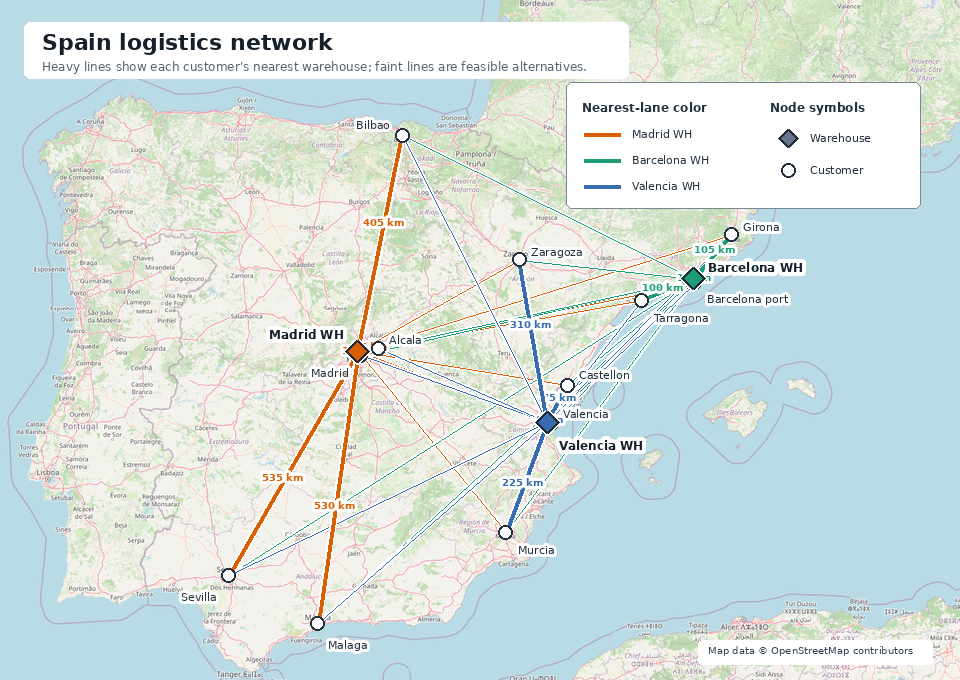

# Logistics Dispatch — Problem Description

## What we are solving

We operate a small road-freight distribution network across Spain. Every day,
customer **orders** arrive for specific products (SKUs). Each order must be
picked from a **warehouse** that holds the SKU and delivered to the customer by
a **vehicle** before its **deadline**. We have a limited, heterogeneous fleet
and finite inventory, so we cannot serve every order immediately.

The decision we make each day is an **assignment**: which pending orders to
dispatch, from which warehouse, on which vehicle. The goal is to find a
*dispatching policy* that maximizes service value (delivering high-priority
orders on time) while minimizing the cost of late deliveries — under
uncertainty about future demand, traffic, and vehicle availability.

This is framed as a **Sequential Decision Analytics (SDA)** problem and
evaluated by Monte Carlo simulation: we run candidate policies over many
sampled futures and compare their outcome distributions, not just point
estimates.

## The environment

### Network (`network.py`)

The network is the physical backbone of the problem: it defines *where* goods
can be stored, *where* they must go, and *how far apart* those places are. Three
things live here.

**1. Nodes — 3 warehouses and 12 customers.**
- Warehouses (supply): `W_MADRID`, `W_BARCELONA`, `W_VALENCIA` — the three
  largest demand hubs on the Iberian peninsula, placed in the centre, northeast,
  and east coast so the fleet can cover the country from three directions.
- Customers (demand): 12 delivery points spread across mainland Spain —
  `C_MADRID_CENTRO`, `C_ALCALA`, `C_BARCELONA_PORT`, `C_TARRAGONA`,
  `C_VALENCIA`, `C_CASTELLON`, `C_ZARAGOZA`, `C_BILBAO`, `C_SEVILLA`,
  `C_MALAGA`, `C_MURCIA`, `C_GIRONA`. Some sit on a warehouse's doorstep
  (`C_MADRID_CENTRO`, `C_BARCELONA_PORT`, `C_VALENCIA`), others are deep in
  another region (`C_SEVILLA`, `C_BILBAO`, `C_GIRONA`), which is what makes
  *which warehouse serves which customer* a real decision.

**2. The lane distance matrix — `LANE_DISTANCE_KM[warehouse][customer]`.**
This is a full 3×12 table of approximate real-world **road** distances (km,
fastest route, rounded to 5 km), not straight-line distances. Reading it tells
you the geography at a glance, e.g.:

| Lane | From Madrid | From Barcelona | From Valencia |
|---|---|---|---|
| → C_MADRID_CENTRO | **10** | 620 | 355 |
| → C_BARCELONA_PORT | 620 | **10** | 350 |
| → C_VALENCIA | 355 | 350 | **10** |
| → C_CASTELLON | 425 | 285 | **70** |
| → C_GIRONA | 710 | **100** | 450 |
| → C_SEVILLA | **530** | 1000 | 660 |
| → C_BILBAO | **395** | 605 | 610 |

Each column has a clear "home" warehouse (bold) and one or two more distant
alternatives. The matrix is geographically consistent — e.g. Alcalá de Henares
is *farther* from Valencia (385) than Madrid is (355), because it lies on the
far side of Madrid, and the cross-country lanes (Barcelona→Sevilla ≈ 1000 km)
dominate the local ones (Valencia→Castellón ≈ 70 km). Lanes where a warehouse
serves a customer in its own city use a short ~10 km last-mile distance.

`lane_distance_km(warehouse, customer)` is the accessor used everywhere else.

**Network visualization map.**



The map is generated by a small Python helper:

```bash
python3 examples/logistics/visualize_network.py
```

It imports `WAREHOUSES`, `CUSTOMERS`, `LANE_DISTANCE_KM`, and
`nearest_warehouse` from `network.py`, downloads the visible OpenStreetMap
tiles for the Spain viewport, and renders a PNG with every
warehouse→customer lane over the basemap. Heavy colored lanes show each
customer's nearest warehouse; faint lanes show the other feasible warehouse
alternatives. The legend also identifies diamond markers as warehouses and
circle markers as customers. Tile requests use a named user agent and are
cached under the user cache directory before being composited into the final
image.

**3. Derived helpers.**
- **`route_days(warehouse, customer, traffic_delay=0)`** — converts a lane
  distance into delivery time as a step function: ≤75 km → 1 day, ≤375 km → 2
  days, ≤650 km → 3 days, else 4 days, **plus** any `traffic_delay` realized
  that day from disruptions. This is what couples distance to the deadline
  pressure in the reward.
- **`nearest_warehouse(customer)`** — the warehouse with the smallest lane
  distance to a customer; used to give each new order a sensible default origin.

Because the matrix is asymmetric in consequence (a long lane costs more transit
days, more distance penalty, and more deadline risk), the network is precisely
what forces the policies to trade off "nearest warehouse" against "warehouse
that actually has the stock and an available truck."

### State (`domain.py`)
The `State` captures everything the policy can observe:
- `inventory`: per-warehouse stock of each SKU.
- `vehicles`: fleet of 6 heterogeneous trucks (capacity 18–32 units), each with
  a location, current load, status (`available` / `en_route`), route, and
  remaining travel time.
- `pending_orders`: orders awaiting dispatch.
- `completed_orders`: orders already delivered.
- `time` and `day_of_week`.

An **`Order`** has an origin, destination, SKU, quantity, **priority** (1–3),
and **deadline** (a day index).

### Decision (`domain.py`, `policies.py`)
A **`Decision`** is a set of **`Assignment`**s, each binding one order to one
(warehouse, vehicle) pair. An assignment is *feasible* only when:
- the warehouse holds enough of the order's SKU,
- the vehicle is currently at that warehouse,
- the vehicle is available and has enough remaining capacity.

Each order can be assigned at most once per day, and each vehicle can take at
most one assignment per day.

### Exogenous information (`data.py`)
What the policy does **not** control, revealed each day as `ExogenousInfo`:
- **New orders** — demand sampled from per-SKU profiles, modulated by
  day-of-week patterns, monthly seasonality, and regional demand weights.
- **Travel times** — per-vehicle traffic delays.
- **Vehicle availability** — random maintenance/outages.

Demand and disruptions are driven by stochastic events: holiday peaks,
promotions, severe weather, and port congestion (`_daily_disruption`), which
lift demand and traffic and raise outage probability. A 365-day
`synthetic_history` is generated and then resampled by a historical bootstrap
sampler during simulation.

### Transition (`transition.py`)
`logistics_transition(state, decision, exogenous)` advances one day:
1. **Apply decisions** — re-validate each assignment, decrement warehouse
   inventory, load the vehicle, set it `en_route` with a travel time that
   includes traffic delay.
2. **Move vehicles** — decrement remaining travel time; when a vehicle arrives,
   complete the stop and record the order as delivered.
3. **Inject new demand** — append the day's new orders to the pending list.
4. **Advance the clock** — increment `time` and `day_of_week`.

### Reward (`transition.py`)
`reward_components` returns, per step:
- **Service value** — credit for newly completed orders, weighted by priority
  and quantity.
- **Late penalty** — a growing cost for pending orders past their deadline,
  scaled by priority and days overdue.

The net reward is `service_value − late_penalty`.

## Policies compared (`policies.py`)

| Policy | Idea |
|---|---|
| `RandomPolicy` | Shuffle feasible assignments, greedily pack a conflict-free set — a baseline. |
| `GreedyPolicy` | Prefer the shortest warehouse→customer lane first. |
| `PriorityPolicy` | Score assignments by priority, deadline urgency/rescue pressure, value, distance, and duration; assign best-first with inventory reservation. |
| `MilpPolicy` | Solve a mixed-integer program maximizing total assignment score subject to one-order, one-vehicle, and per-SKU inventory constraints (falls back to `PriorityPolicy` if infeasible). |

## How it is evaluated (`run.py`)

Each policy is run for a **30-day horizon** over **100 replications** using a
historical bootstrap sampler (7-day blocks). The metrics collected are:

- `service_value` (↑) — total delivery value.
- `late_cost` (↓, tail-risk tracked) — total lateness penalty.
- `net_reward` (↑) — service minus lateness, reported with a 95% CI.
- `delivered_orders` (↑) — count delivered.
- `final_late_orders` (↓) — orders still overdue at the horizon.

Because outcomes are stochastic, policies are compared on **distributions** —
means, confidence intervals, and the **CVaR (95%)** of late cost to capture
tail risk in bad scenarios — rather than a single run.

## The objective in one line

> Find a daily dispatch policy that maximizes on-time, high-priority service
> across uncertain demand and disruptions, while keeping late-delivery cost —
> especially in worst-case scenarios — low.
