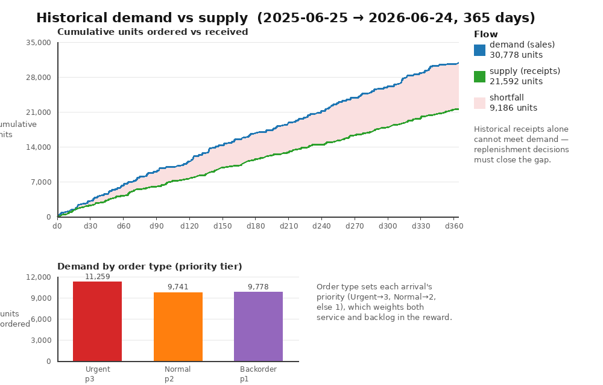
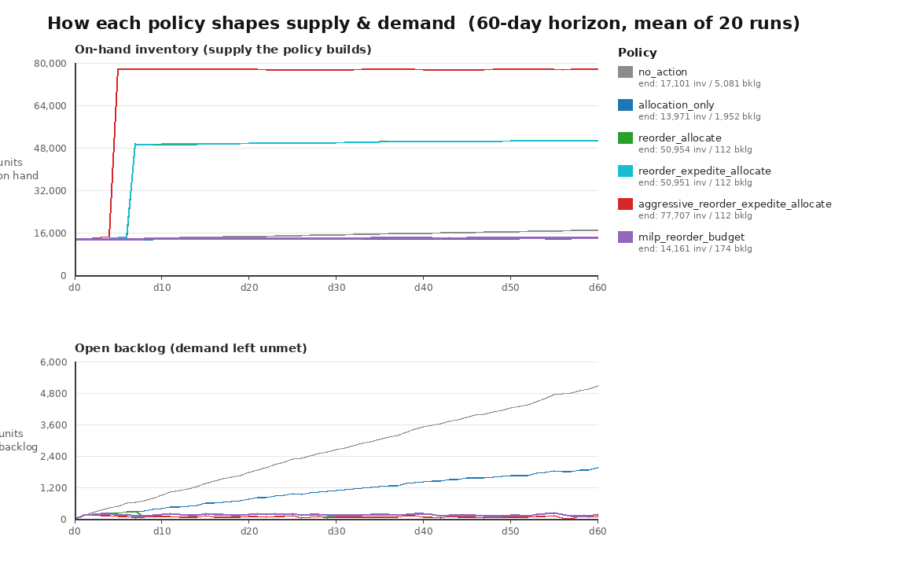

# Simulated Inventory Management — Problem Description

## What we are solving

We run the materials inventory of a multi-plant manufacturer. Across **5
plants** we stock **100 materials** — raw, semi-finished, and finished goods —
that **50 customers** order and **29 suppliers** replenish. Every day customer
**sales orders** arrive for a given material at a given plant, and replenishment
**purchase orders** placed earlier arrive from suppliers after a lead time.

The tension is the classic inventory one. Stock is finite and refilling it is
not instant: a purchase order takes days to receive, so what we can fulfil today
is bounded by what we ordered days ago. Demand we cannot cover from on-hand
stock becomes **backlog** — unhappy customers waiting; stock we hold but do not
need ties up cash as **overstock**. We cannot eliminate both at once, so the
job is to keep the right amount of the right material at the right plant as
demand and supply timing shift underneath us.

The decision we make each day is a combination of three levers: **reorder**
(open or grow a purchase order to refill a low inventory position),
**expedite** (pull an open purchase order's receipt date earlier), and
**allocate** (assign available on-hand stock to known backlog). The goal is to
find a *replenishment-and-allocation policy* that maximizes fulfilled demand
while minimizing backlog and overstock — under uncertainty about future demand
and supply timing.

This is framed as a **Sequential Decision Analytics (SDA)** problem and
evaluated by Monte Carlo simulation: we run candidate policies over many
sampled futures and compare their outcome distributions, not just point
estimates.

## The data

The world is reconstructed from a synthetic but **SAP-style ERP dataset** in
`data/`. We have the familiar order tables — `SalesOrderDocuments` /
`SalesOrderItems` (demand), `PurchaseOrderDocuments` / `PurchaseOrderItems` and
`PurchaseRequisitions` (the supply pipeline), `Materials`, `MaterialStocks`
(on-hand positions), `GoodsReceiptsAndIssues` (stock movements), and
`OrderSuggestions` (reorder suggestions). These are also flattened into an
**Object-Centric Event Log (OCEL)**, where each event (*Create Purchase Order
Item*, *Goods Receipt*, *Goods Issue*, …) is linked to the objects it touches
(material, plant, purchase-order item, sales-order item, customer, supplier).
The dataset spans roughly **one year** (2023-09-26 → 2024-09-25).

### Inspecting the data

Before running any policy, it helps to look at what the year of history actually
contains. The helper script renders it as a two-panel figure:

```bash
python3 visualize_data.py
```



It reads the same `load_inventory_simulation_data()` the simulator uses, so the
picture is exactly the world the policies face. Two facts jump out, and both
drive the whole problem:

- **Supply tracks demand, but does not quite cover it (top panel).** Over the
  year, customers order **~30,800 units** while historical goods receipts deliver
  **~21,600** — receipts meet about **70%** of demand, leaving a **~9,200-unit
  shortfall** (the shaded gap). Together with the opening on-hand stock the
  system is *roughly* balanced, so this is not a desperate catch-up: the gap, plus
  the **lumpy timing** of receipts and the mismatch between *which* `(material,
  plant)` has stock and which has orders, is what the reorder, expedite, and
  allocate levers exist to manage. A do-nothing policy still falls behind, but a
  good one has real room to close the gap without drowning in overstock.
- **Demand arrives in three priority tiers (bottom panel).** Each sales order's
  type sets its priority — **Urgent → 3** (~11,300 units), **Normal → 2**
  (~9,700), and everything else (here **Backorder**) **→ 1** (~9,800). Because the
  reward weights both service and backlog by priority, *which* demand a scarce
  unit of stock protects matters as much as how much is served — the lever the
  allocation and MILP policies pull on.

### Extraction (`extract_policy_inputs.py`)

`load_inventory_simulation_data()` reads the database and separates two things
the simulator needs:

- **State inputs** — the opening `inventory` positions (per
  `(material, plant)`, with available stock derived from posting/transfer/
  returns minus blocked), the open `purchase_orders` pipeline (with expected
  receipt dates and planned lead times), plus material/customer/supplier
  profiles.
- **Exogenous history** — a per-day timeline (`DailyInventoryExogenous`) of
  **demand arrivals** (sales-order items posted that day) and **supply
  arrivals** (goods receipts posted that day, linked back to their purchase
  order). This 1-year history is what the sampler later resamples.

The same module also emits flattened analysis tables
(`daily_inventory_levels.csv`, `policy_item_inputs.csv`) with per-day,
per-item state/exogenous/outcome features for offline policy learning.

## The environment

### State (`domain.py`)

The `State` captures everything the policy can observe at a decision epoch:

- `inventory`: available stock keyed by `(material_id, plant_id)`.
- `pipeline`: open `OpenPurchaseOrder`s — outstanding replenishment in transit,
  each with a `quantity_open`, `expected_receipt_date`, and `expedited` flag.
- `backlog`: known-but-unfulfilled `BacklogOrder`s awaiting allocation, each
  with quantity, customer, priority, arrival date, and optional due date.
- `completed_orders`: cumulative fulfilled quantity per order.
- `date` and `time` (the integer step index).

### Decision (`domain.py`, `policy.py`)

A **`Decision`** bundles three optional action sets, all applied in the same
epoch:

- **`ReorderAction`** — create or grow a purchase order for a `(material,
  plant)`, with an `expected_receipt_date` set `lead_time_days` out. Simulated
  reorders carry a `SIM-PO-…` id so the transition can receive them on time.
- **`ExpediteAction`** — move an open purchase order's receipt date earlier
  (capped at the current date), at an `expedite_cost`.
- **`AllocateStockAction`** — commit available inventory to a specific backlog
  order. Allocation is bounded by `min(requested, order_open, on_hand)`.

### Exogenous information (`domain.py`, `sampler.py`)

What the policy does **not** control, revealed *after* its decision each day as
`ExogenousInfo`:

- **Demand arrivals** — new sales-order quantities for `(material, plant)`,
  which become next-epoch backlog. Each arrival carries a **priority** derived
  from its order type (`Urgent → 3`, `Normal → 2`, else `1`) and a **due date**
  set by a priority-dependent SLA (tighter for higher priority), so allocation
  can favor the orders that matter most.
- **Supply arrivals** — realized goods receipts that raise inventory and burn
  down the open pipeline.

`InventoryHistoricalSampler` drives this. On `reset(replication)` it picks a
reproducible random start day in the 1-year history and then returns
**consecutive days with wraparound** — preserving the observed day-to-day
demand/supply timing within each sample path rather than shuffling it. The
simulation clock advances **monotonically** (one day per step, anchored at the
initial date) independent of the wrapped historical dates, so date-gated
replenishment receipts stay consistent across a year boundary.

### Transition (`transition.py`)

`inventory_transition(state, decision, exogenous)` advances one day, in order:

1. **Apply reorders** — add/grow `SIM-PO-…` orders in the pipeline.
2. **Apply expedites** — pull receipt dates earlier (for the controllable
   `SIM-PO-…` orders, whose timing the policy can actually move) at a cost.
3. **Receive supply** — credit any `SIM-PO-…` now due, then apply realized
   exogenous goods receipts (decrementing the matching open PO).
4. **Apply allocations** — move on-hand stock to backlog orders, recording
   completed quantity and clearing fully-served orders.
5. **Inject new demand** — append the day's demand arrivals to backlog.
6. **Advance the clock**.

Because the simulator calls the policy *before* sampling exogenous info,
allocations can only serve backlog already known at the epoch; same-day demand
must wait for the next decision.

### Reward (`transition.py`)

`reward_stockout_overstock_service` returns, per step, a single contribution
computed from the very same transition the simulator runs:

> **`reward = allocated_value − 3.0 · backlog_value − 0.02 · overstock_quantity − expedite_cost`**

- **Service value** (`+`) — units allocated to demand this step, **weighted by
  priority** (a priority-3 unit is worth 3× a priority-1 unit).
- **Backlog penalty** (`−3.0×`) — the heavy cost of unmet, known demand, also
  **priority-weighted**, so failing high-priority orders hurts most.
- **Overstock penalty** (`−0.02×`) — a small holding cost on every on-hand
  unit, discouraging carrying stock for its own sake.
- **Expedite cost** (`−`) — the fee charged for each pulled-in purchase order,
  so expediting is a genuine tradeoff rather than free speed.

The 3.0-vs-0.02 asymmetry makes a missed sale far more expensive than a unit of
excess inventory, so good policies lean toward availability without hoarding —
while the priority weighting and expedite cost force them to spend scarce stock
and expediting budget where they buy the most service.

## Policies compared (`policy.py`)

| Policy | Idea |
|---|---|
| `NoOpPolicy` | Do nothing — a baseline to measure how much the action levers are worth. |
| `AllocationOnlyPolicy` | Only allocate existing stock to backlog (by priority, then due date and age); never reorder or expedite. Isolates allocation value. |
| `ReorderAllocatePolicy` | Allocate backlog **and** reorder any item whose inventory position (on-hand + pipeline) falls below a reorder point, up to an order-up-to target. |
| `ReorderExpediteAllocatePolicy` | The full baseline: reorder low items, **expedite** open POs for items currently in backlog, and allocate. |
| `AggressiveReorderPolicy` | Same full action set with higher targets (reorder point 130, order-up-to 220, shorter lead time) — carries more inventory to avoid stockouts. |
| `MilpReorderPolicy` | Same allocation + expedite, but reorders are chosen by a budget-constrained MILP instead of fixed thresholds. A 0/1 knapsack (`scipy.optimize.milp`) spends a per-epoch **reorder budget** across competing items to protect the most priority- and urgency-weighted *uncovered* backlog; falls back to `ReorderExpediteAllocate` if scipy is unavailable. |

The shared helpers implement a classic **(s, S) reorder rule** on inventory
position, priority-ordered allocation, and backlog-driven expediting. The MILP
policy instead reorders *reactively* — only to cover known backlog that on-hand
stock and the open pipeline cannot, allocating a scarce reorder budget where it
buys the most weighted service. Because items compete for that shared budget,
the choice is a genuine optimization rather than an independent per-item rule;
in practice it reaches the best net reward while carrying far less inventory
(less overstock) than the threshold policies, at the cost of a little more
backlog risk under lumpy demand.

## How it is evaluated (`run.py`)

Each policy is run for a **60-day horizon** over **20 replications** using the
historical sampler (seed 42). The metrics collected are:

- `reward` (↑) — total per-step contribution, reported with a **95% CI** (how
  precisely the mean is known) and its **CVaR (95%)** — the mean reward in the
  *worst 5%* of runs, i.e. how bad a bad month looks.
- `final_backlog` (↓) — open backlog quantity remaining at the horizon, also with
  its upper-tail **CVaR (95%)** (the worst-case leftover backlog).
- `final_inventory` (—) — total on-hand stock left, reported for context (a
  policy can score well by carrying just enough, not the most).

Because outcomes are stochastic, policies are compared on **distributions**, not
a single run: the **CI95** says whether two means are really different, while the
**CVaR95** says how *stable* a policy is — a policy whose worst-case is close to
its mean is dependable, one whose tail blows out is a gamble. Each
`evaluate_metrics` report can also be logged to Weights & Biases.

## Interpreting Results

Running `SDA_MC_WANDB=0 python3 run.py` (60-day horizon, 20 replications, seed
42) produces a table like this. These are **actual numbers** from the example,
so your run should reproduce them closely:

```text
policy                                 reward_mean                reward_ci95  reward_cvar95  backlog_mean  backlog_cvar95  inventory_mean
─────────────────────────────────────────────────────────────────────────────────────────────────────────────────────────────────────────
no_action                              -1009335.45  (-1098417.27, -920253.64)    -1340250.73       5081.85         6243.50        17101.41
allocation_only                         -412720.92   (-451140.76, -374301.08)     -576503.68       1952.05         2458.39        13971.61
reorder_allocate                         -82913.65     (-85659.75, -80167.55)      -96001.58        112.05          398.00        50954.85
reorder_expedite_allocate                -78480.84     (-80070.96, -76890.72)      -84647.82        112.05          398.00        50951.90
aggressive_reorder_expedite_allocate    -110278.72  (-111774.44, -108783.01)     -116143.69        112.05          398.00        77707.25
milp_reorder_budget                      -62171.26     (-65372.10, -58970.42)      -74437.87        174.96          555.32        14161.22
```

(Every reward is negative because each replication starts from a large standing
backlog inherited from the opening state — the ranking, i.e. how much of that
cost each policy claws back, is what matters, not the sign.)

**How to read the columns:**

- **reward_mean** (↑) — priority-weighted service minus priority-weighted
  backlog, overstock holding cost, and expedite fees, summed over the horizon.
  The headline objective.
- **reward_ci95** — 95% confidence interval on reward across the 20 replications.
  Intervals that **don't overlap** mark a real, repeatable difference; ones that
  **overlap** are statistically close.
- **reward_cvar95** (↑, stability) — the mean reward in the **worst 5%** of runs.
  The closer it sits to `reward_mean`, the more *dependable* the policy; a CVaR
  far below the mean means the policy occasionally has a very bad month.
- **backlog_mean** (↓) — open (unfulfilled) demand quantity left at the horizon.
- **backlog_cvar95** (↓, stability) — the worst-5% leftover backlog, i.e. how bad
  the service shortfall gets in a bad scenario.
- **inventory_mean** (—) — on-hand stock left at the horizon. *Not* "more is
  better": stock you carry but don't need is pure overstock cost. Read it
  alongside backlog as the two sides of the tradeoff.

**What this tells you:**

- **Doing nothing falls behind on both fronts.** ``no_action`` ends with 5,082
  units of backlog *and* lets ~17k of arriving supply pile up unused (−1,009k).
  Every other policy is judged by how much of that it recovers.
- **Allocation alone is now a real lever.** Because opening stock sits where
  demand is, ``allocation_only`` clears most backlog just by spending what is on
  hand — backlog 5,082 → 1,952, reward −1,009k → −413k (well over half the
  recovery) without ordering a thing.
- **Reordering clears the backlog — but fixed targets overstock.** The (s, S)
  policies drive backlog down to ~112, yet because supply already covers ~70% of
  demand, their fixed order-up-to targets pile inventory to **~51k**. Reward lands
  at −83k/−78k: the backlog is gone, but overstock holding cost is now the
  dominant drag.
- **Expedite still earns its cost.** ``reorder_expedite_allocate`` edges out
  ``reorder_allocate`` (−78k vs −83k) by pulling its own SIM-PO receipts in; the
  fee is charged, but earlier availability pays for itself.
- **Hoarding is now clearly punished.** ``aggressive_reorder`` reaches the same
  backlog (112) but carries **77k** of stock — its overstock penalty drops it to
  −110k, *worse than the standard policy and far below the MILP*. More inventory is
  not more money.
- **The budget MILP wins decisively.** ``milp_reorder_budget`` posts the best
  reward (−62k) and, unlike on the old data, its CI (−65.4k, −59.0k) **does not
  overlap** the threshold policies' — a statistically real win — while holding
  just **14k** of inventory (about a third of theirs). Reordering only the
  priority-weighted backlog its budget can protect clears demand without the
  overstock.
- **It is also the most stable, not just lucky-on-average.** Read down the
  `reward_cvar95` column: the MILP's worst-5% reward (**−74k**) is the best tail of
  any policy and sits close to its **−62k** mean, so a bad month is only modestly
  worse than a typical one. The baselines, by contrast, have tails that blow out
  (``no_action`` −1,009k mean → **−1,340k** worst-5%); their bad scenarios are
  *much* worse than their averages. Low mean **and** a tight tail is what makes a
  policy trustworthy to deploy.

**The bottom line for the business:**

- **Use what you have first.** With stock positioned where demand is, disciplined
  allocation recovers more than half the value before a single new order — the
  cheapest lever, and the one most easily overlooked.
- **Don't let fixed reorder targets run the warehouse.** When suppliers already
  cover most demand, a blanket order-up-to rule buys inventory you don't need; the
  worst offender (``aggressive``) carried 77k of stock to make *less* money than a
  lighter policy.
- **Budget reordering to the demand most at risk.** The MILP clears backlog with a
  third of the inventory *and* a statistically clear reward lead — the freed
  working capital is the prize, and here the reward gap confirms it outright.
- **Compare distributions, not single runs.** Confidence intervals separate a real
  winner (the MILP) from near-ties among the threshold policies, and the CVaR95
  tail tells you which policy survives a bad month — a single run could not
  reliably tell an overstock-heavy −83k from a −110k, let alone how stable either
  is.

## The objective in one line

> Find a daily reorder/expedite/allocate policy that fulfills as much demand as
> possible across uncertain demand and supply timing, while keeping both
> backlog and excess inventory low.

## How the policies reshape supply and demand

Demand is exogenous — every policy faces the identical order stream. What a
policy *controls* is the supply it injects (reorders) and how it spends on-hand
stock, so the sharpest way to tell the policies apart is to watch the state they
produce over the horizon:

```bash
python3 visualize_policies.py
```



Each line is the mean of 20 runs, and the two panels are the two halves of the
objective:

- **On-hand inventory (top) — the supply side the policy builds.**
  ``aggressive`` (red) blows past **78k** units within a week and parks there;
  the standard threshold policies (``reorder_allocate``,
  ``reorder_expedite_allocate``) jump to **~51k** by day 7. All three keep
  ordering toward a fixed target that the historical supply has already nearly
  met, so stock simply piles up as overstock. ``no_action``, ``allocation_only``,
  and ``milp_reorder_budget`` stay lean (**~14–17k**).
- **Open backlog (bottom) — the demand left unmet.** ``no_action`` (grey) climbs
  steadily to **~5k** as orders arrive and nothing is replenished; ``allocation_only``
  (blue) bleeds up to **~2k** once its opening stock is spent. Every reordering
  policy holds backlog near zero throughout.

Read together, the figure is the whole tradeoff in one picture: the threshold
policies kill backlog only by drowning in inventory, while ``milp_reorder_budget``
is the one line that stays **low on both panels** — injecting just enough supply,
just in time, to keep demand covered without hoarding. That lean-but-covered
trajectory is exactly why it posts the best reward.
